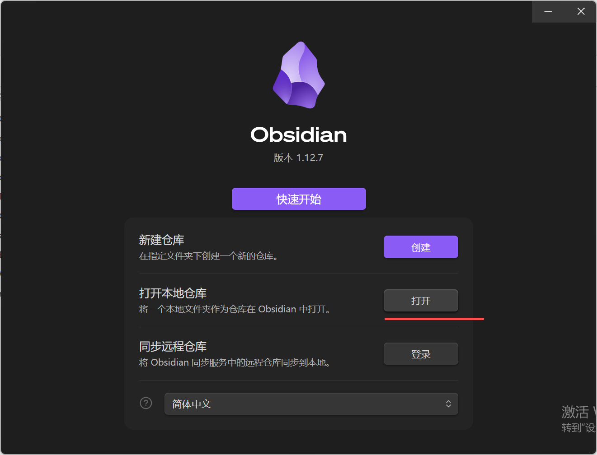
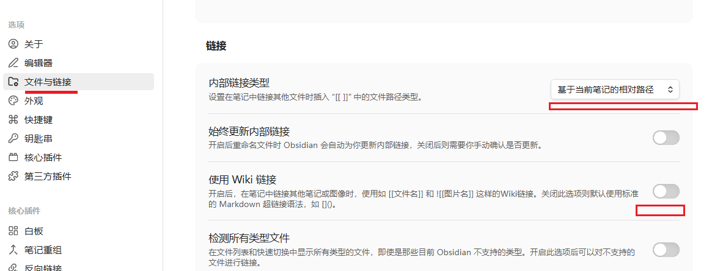
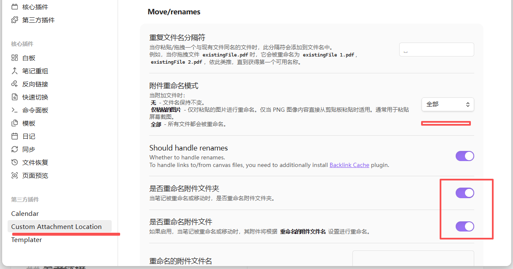

## 原因
- 本地md的格式，数据绝对安全，加载速度很快，files over platform的思维，迁移能力非常强
- 大模型交互友好，之前云端笔记，在大模型直接手动搬运来回
- 插件和git的生态，版本管理，功能扩展，稳了
- 文件间的组织结构方式多样
	- 目录tree
	- tag
	- 引用和被引用（自动知识图谱）

## github
- 创建自己的github仓库，克隆到本地
- 用 obisidian 打开本地项目
- 把 obisidian 的配置文件加在git ignore里面就行 ^c7c9f0

## 插件
### custom attachment location
源自抖音，改了2个地方的配置，让图片用md原生语法，自动在assets路径下面更新

### Templater
说是支持JavaScript，用变量配置模板

源自 [Obsidian 笔记软件使用教程 - steve.z - 博客园](https://www.cnblogs.com/zxhoo/p/19730901)
### Calendar
说是可以按日历看笔记数量

源自 [Obsidian 笔记软件使用教程 - steve.z - 博客园](https://www.cnblogs.com/zxhoo/p/19730901)
### file explorer note count
文件目录自动显示笔记数量

源自 [Obsidian使用教程（如何构建你的个人知识库，第二大脑）-CSDN博客](https://blog.csdn.net/Keep__Me/article/details/132948913)

### 其他

另外还有 clear unused images插件，等用的时候可以装，自动删除不被引用的图片，源自 [Obsidian使用教程（如何构建你的个人知识库，第二大脑）-CSDN博客](https://blog.csdn.net/Keep__Me/article/details/132948913)

同样的链接里面还有 editing toolbar 文字编辑工具栏 等用的时候再装吧

- **Novel Word Count**：统计文件夹内笔记数量与字数（我这个版本没装插件，也有字数）
- **Number Headings**：自动给多级标题编号
- **Git**：源自 [Obsidian 笔记软件使用教程 - steve.z - 博客园](https://www.cnblogs.com/zxhoo/p/19730901) 但我感觉手动传大版本比较好，定期比如10分钟，太琐碎了（可能适用于手机自动传git，电脑就手动传了：继承了脚本，改下commit message就行，很便捷 [commit_all.sh](..\tools\commit_all.sh)）

## 相关链接

[Obsidian 教程 | 菜鸟教程](https://www.runoob.com/obsidian/obsidian-tutorial.html) 分了快10个章节，比较系统全面
